author: Sam Ogden
summary: CS4518 Android UI tutorial
id: UI
categories: UI
environment: java
status: draft

# CS4518 Android Application UI Totorial
## Overview of Tutorial
Duration: ???

This tutorial will show you how to create a UI for your Android app.  In this tutorial you will do the following:

* Make a button!
* Make another button!
* Put some text in!
* Maybe go crazy with a scrollwheel!

Prerequisites:

* Android Studio Installed
* Android Phone supporting API 27 or later
    * Or AVD installed with API 27 or later

We recommend you've programmed in Java before.


## Make A New Project
Duration: 10 minutes

The first step to making a new application is to start a new project.

### New project window

Conveniently, when you first open Android Studio it will ask you to start a new project.

Positive
: Note: If you already have a project open and want to start a new one then use the `File > New > New Project...` menu items

To get started click the "Start a new Android Studio project" button

 

### Create Android Project

- This brings you to the "Create Android Project" window where you enter information about your project.
- **Application name:** it is best to pick something descriptive yet creative.
    - As you can see I went the purely boring descriptive path.
- Your "Company domain" should be your username followed by your organization.
    - This can generally match your email, so mine is **ssogden.wpi**.  It's best to keep this simple because we will need it later on when debugging.
- There are also options for C++ and Kotlin support.  We won't be going into these but you may want to use them for future projects!


### Target Android Devices

- The next step is to choose which API you're targeting for your application
- This is more of an issue when using real devices
- Android OSes are generally backwards compatible but not necessarily forward compatible
    - That is, pick an older API is safer as the apps can run on newer devices
- We're eschewing this advice and picking a recent API, API27
    - It has support for more deep learning features
- For more information you can click on "Help me choose" which describes different API levels

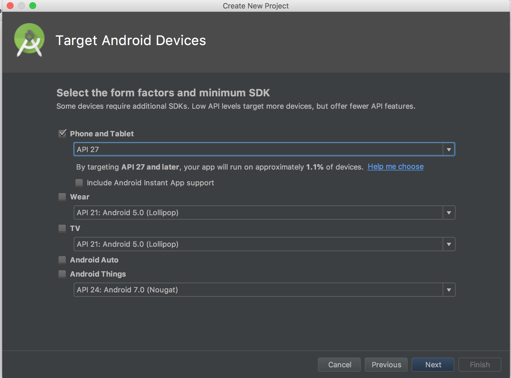

### Add an Activity to Mobile

- Next, we select what kind of application we want to build
- To keep things simple we'll select "Empty Activity"

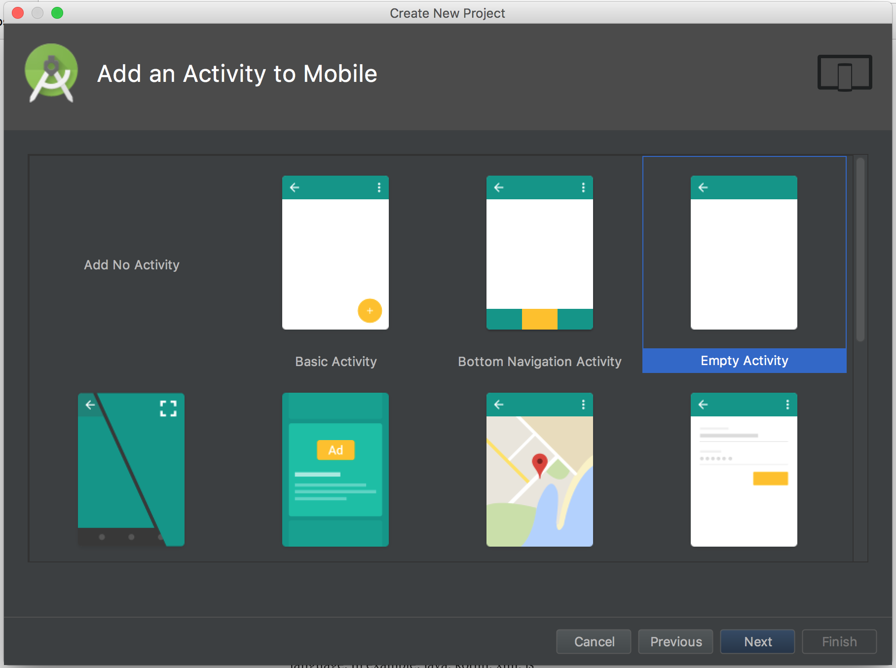

### Configure Activity

- Finally, we configure the activity
- Since this will be the only real window of our basic application we'll leave it named "MainActivity"
    - Feel free to get more creative, but remember that the tutorial will be using "MainActivity"
    - Helpful for more complex applications
- Generally this can be left as is

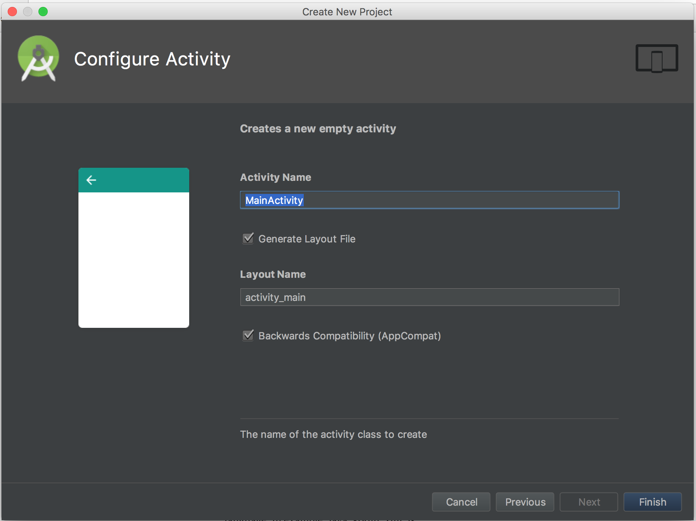

Hit Finish and you're good to go!

### But wait....

....what's this error?


- This error is just telling us that we don't have any compatible systems to actually run our app on
- In the next step let's create an AVD for running our tests on


## Setup AVD
Duration: 5 minutes

Fixing the error we saw in the last step is easy, we just need to set up an Android Virtual Device (AVD) for our app to run on

### Open AVD manager

- To do this go to Tools > Android > AVD Manager menu to launch the AVD manager
    - Alternatively you can just hit the Run button and it will complain and pop you directly to setting up an AVD

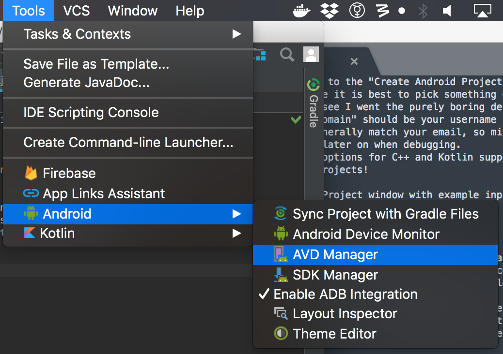

### Android Virtual Device Manager

 - This panel is extremely straightforward right now: just hit the "Create Virtual Device" button to get started
    - Later on there will be more options available on this page
    
### Create New AVD - Select Hardware

- The first step to set up a new AVD is to select what hardware you want simulated
- This mostly affects what the AVD looks like and how big the screen simulated this
    - This affects the GUI by changing how big the different GUI elements can be

- Let's pick the Pixel 2 device for now
    - It's a reasonably sized phone and if you have a physical one is a good device for mobile inference


### API Selection

- On this panel we select the API that we want to use
- Since we set up our application to work with API 27 we should select it
    - You may need to press the "Download" button next to the API 27 image if this is your first time running the AVD manager
    


### Android Virtual Device detail screen

- This page is for customizing our AVD
    - Can be used to change the name, the orientation or even how much RAM is available to the Android OS
- We're going to leave it largely as-is for right now
- Click the "Finish button!"

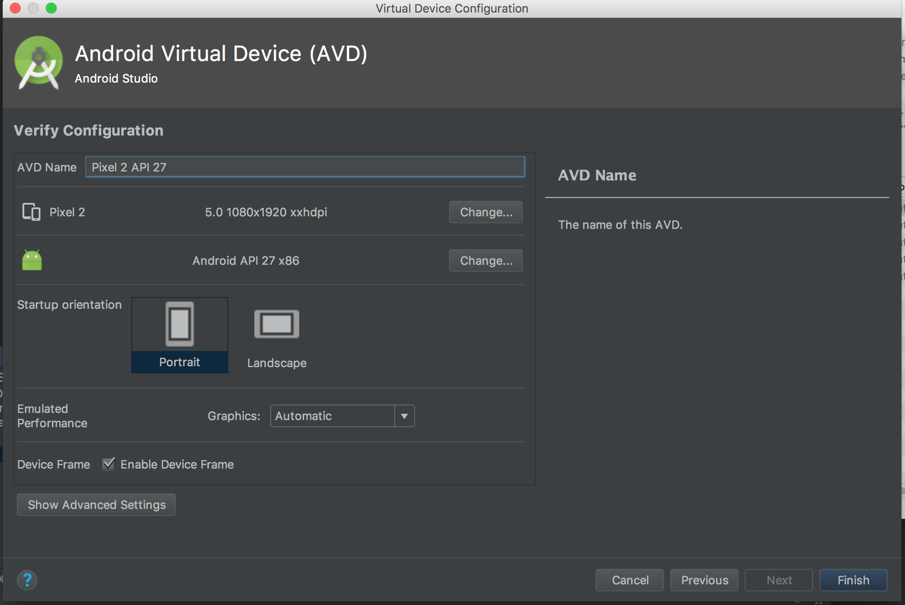

### Back to the Android Virtual Device Manager

- We should now see our new virtual device listed in the Virtual Device Manager
    - There are also new options now from the drop-down arrow on the device but we'll use those later
- Just close the Virtual Device Manager window and return to the main page


### Back to the main page

- Hit the "Run" button (green side-ways pointing triangle) and select your AVD from the list of Available Virtual Devices
- Your app

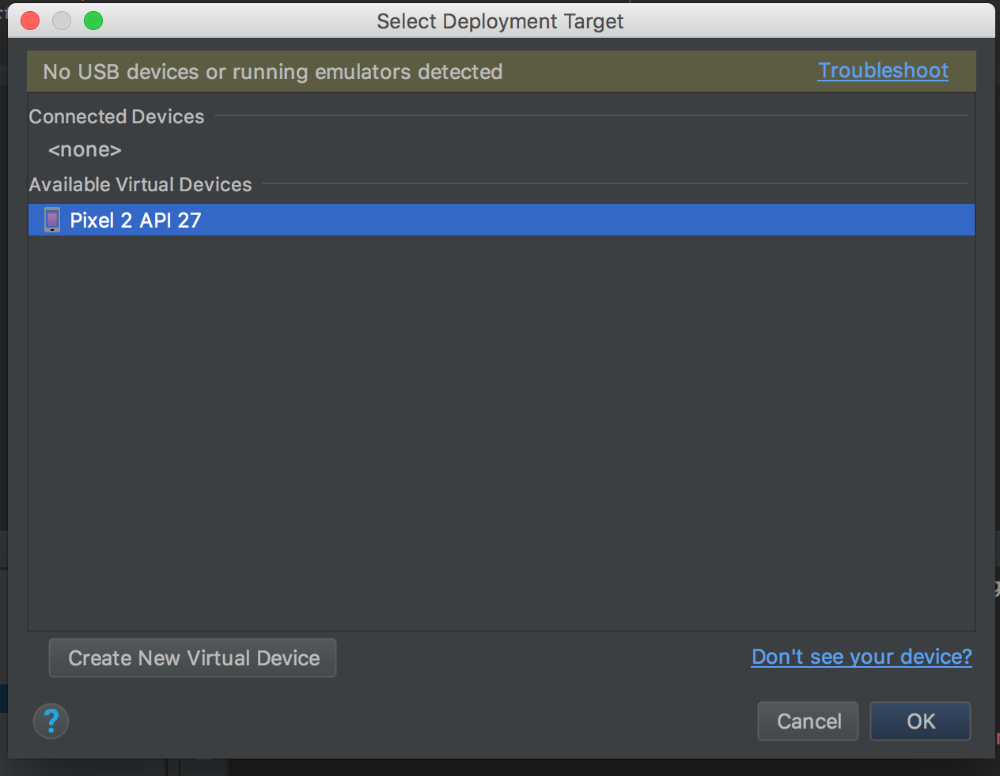

- Your AVD should launch and your error should now be gone!
    - This may take a little while to happen for two reasons.  Your AVD boots cold which is slow, and the "android gradle" needs to be built.
    - Be patient!

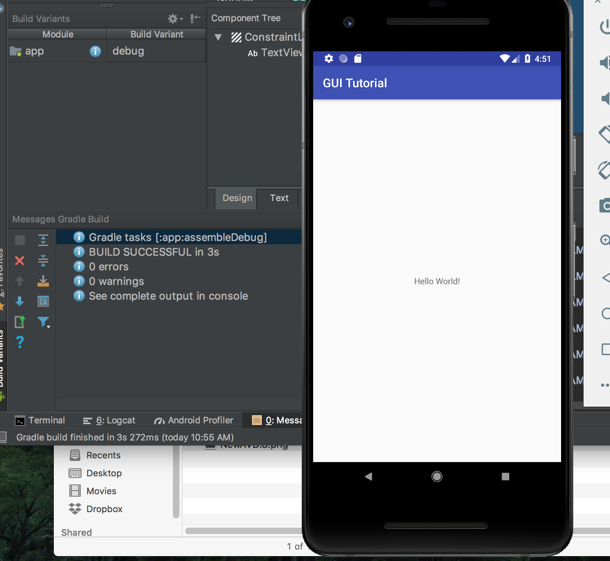

*Huh.  Looks kind of boring, doesn't it?
Let's see if we can't fix that, shall we?*


## Making your first GUI!

Now that we have all the background set up its time to start making your GUI.
The first step is to open up the graphical layout so you can place buttons more easily.
This is found either along the top bar, as "activity_main.xml," or in the project filedraw under app > res > layout > activity_main.xml.

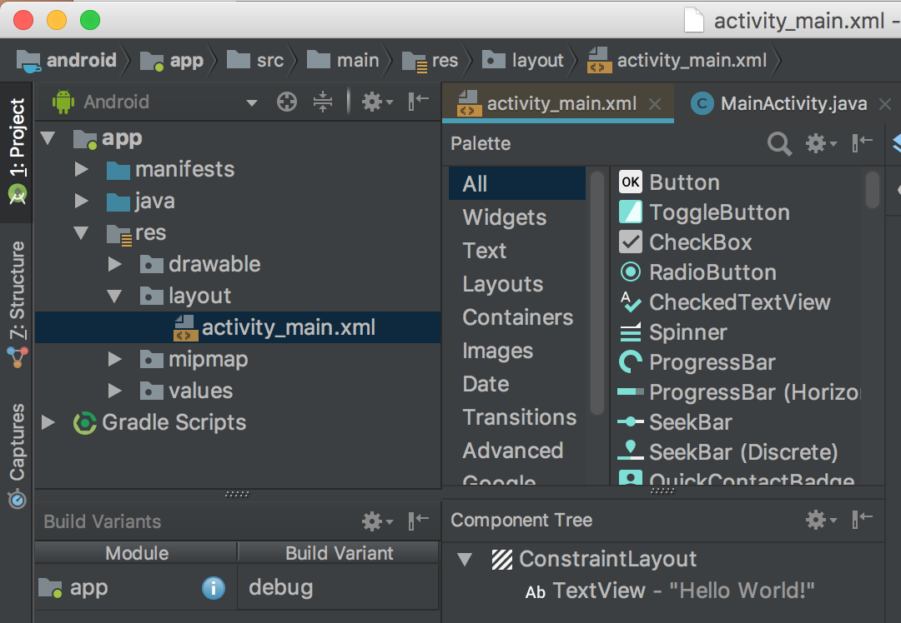

Once you have your activity_main.xml screen open it should look like the below:


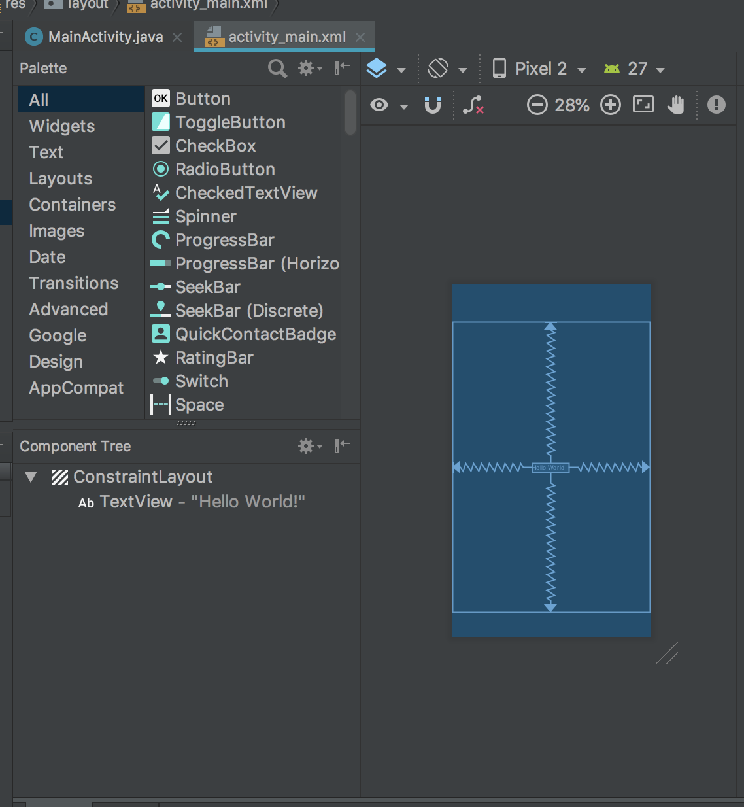

On the lefthand side of this picture are quick links to various kinds of elements while the rightside consists of a blueprint of the layout. 
In the blueprint right now you can see that there is one element already, the "Hello world!" text that can be seen in the previous section and is added by default.
The zig-zag lines indicate that this text has constraints on it to keep it a relative distance to each of the edges indicated by the lines.

*For this tutorial we're going to be implementing this from scratch so delete this text by clicking on it and pressing the backspace button.*


### Adding your first GUI element

To add your first GUI element all you have to do is drag it from the sidebar onto the blueprint.
Positive
: You can take advantage of auto-constraints by first selecting the rectangle in your blueprint and then dragging your button until dotted lines show up, as in the picture below.

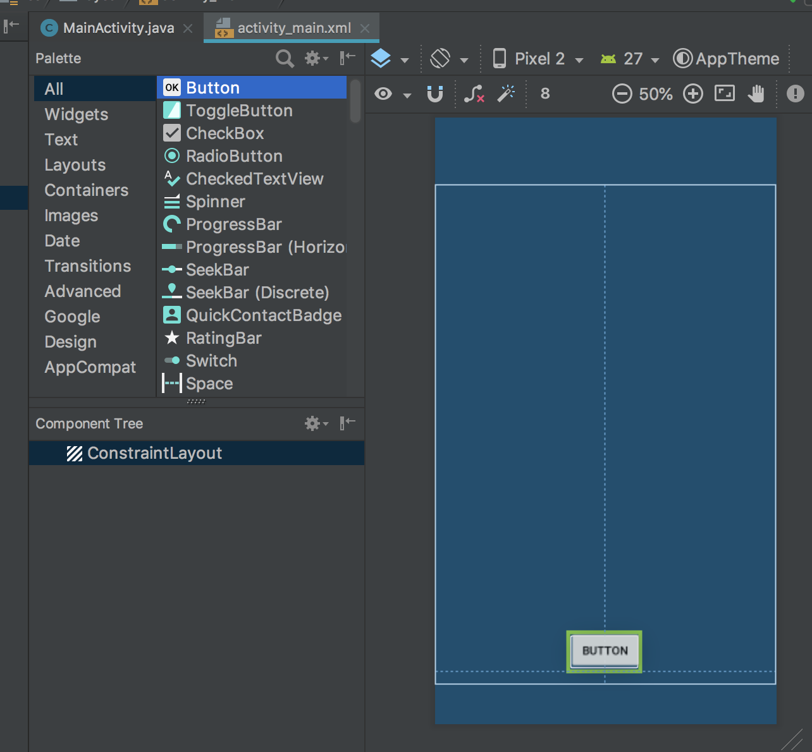

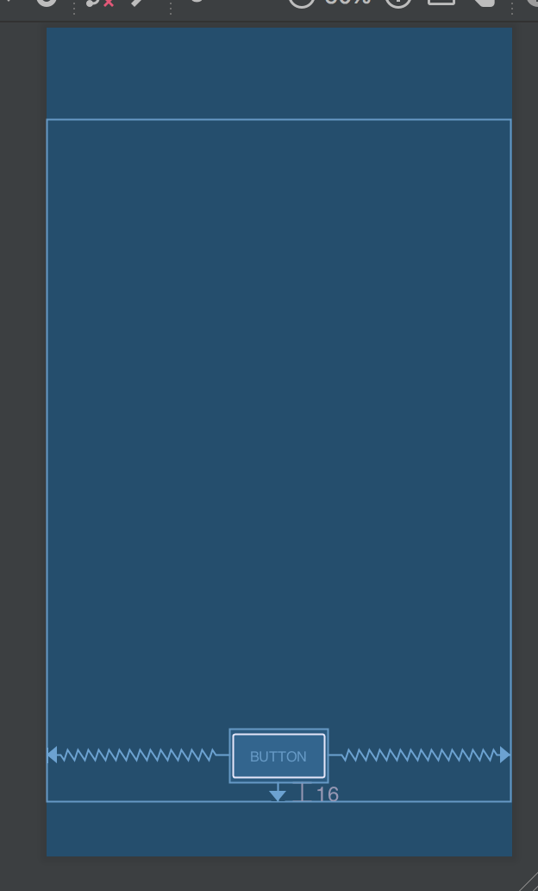


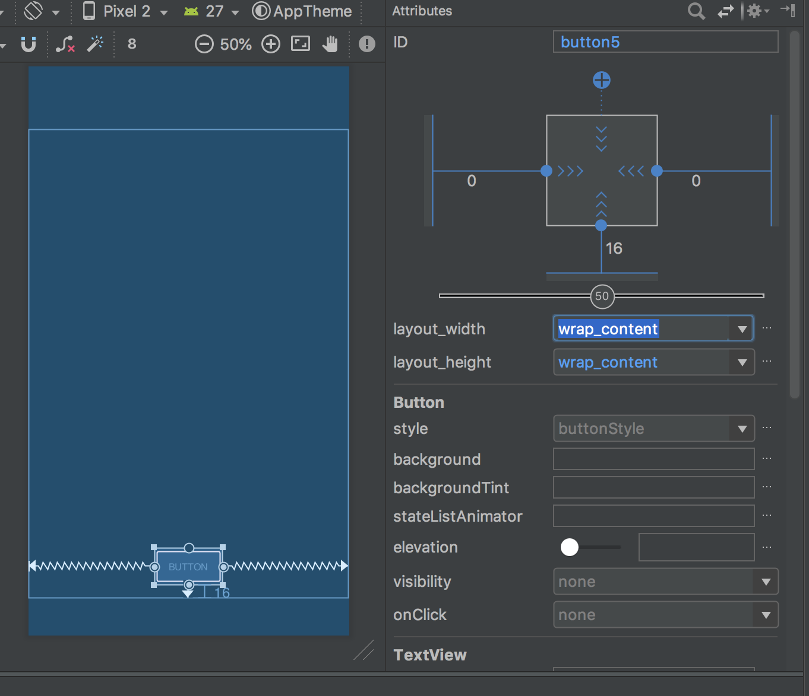

You can also customize your button via its attributes panel.  This pannel is shown to the right of the blueprint when you select your button.
This can be used to change things about the button such as the text therein, which is controlled via the TextView > text attribute.
One attribute you should change is the ID up at the top of the pannel.  This is how we'll be referring to this element in our code so it's best to pick something descriptive.  I'm going to change mine to goButton.

### A quick word on constraints

Constraints make your application look good.
They determine how close or far elements are to each other and to the sides.
They also can be tricky to set correctly in complex layouts.

*I won't be going into great detail about how to set constraints in this tutorial.  Instead I'll be largely using automatically set constraints.  There are other, more detailed tutorials about how to make pretty GUIs I recommend you check out.*

All that said, constraints are controlled by defining relationships between elements (dragging from the little circle on the side of an element to another element), and using the attributes panel to define how you want them to be enforced.

There are three types of constraints used in Android
1. *Fixed*: The width of the element is fixed at all times and the element floats relative to other objects
2. *Wrap content*: The element will expand to fit its contents and float relative to other objects
3. *Math constraints*: The element will expand as much as possible to fill all the space it can between it and other objects.

More details on constraints can be found at [https://developer.android.com/training/constraint-layout/](https://developer.android.com/training/constraint-layout/)


### Check your GUI out!

Press the "Run" button (or hit cntl-R) and select your AVD and your app should will run.


It's exciting, but isn't that GUI a little bit boring?
Let's make it a tiny bit more exciting in the next step, shall we?


## Adding pictures to your GUI

In order to fix how boring our app currently is let's add in some cute cat pictures! (Note: feel free to use puppy pictures instead)

### Setup

First off, we need to create an assets folder to keep our photos of kittens.  We do this by right-clicking on the "app" in the project explorer and navigating to New > Folder > Assets Folder.


This brings up a dialogue where you have nothing to do but press "Finish".  Super simple, right?


*But wait, there's more!*
While you can stop here, it's always best to keep folders so you can be organized.  So let's make a directory inside our new assets folder.  To do this, right-click on the assets folder and navigate to New > Directory and give it a name.  Mine's going to be kitten_pictures.
This folder should now show up in our app directory tree.

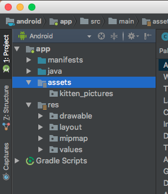


### Storing pictures to your project

Adding pictures to your folders is super simple:  You just drag them to it.  This may not work directly from your browser but you can drag from your desktop and they will be copied over.  A quick dialogue will show up to ask if you want to change their name or update references to them, but you can generally just click "OK" for this and they'll be added in.
Android Studio may open up the photos for you to edit them but you can just close them again if it does so.

Positive
: You can also add the photos through your normal explorer window by opening the folder using the right-click menu or finding it manually.

*Add 5 or so photos to your assets folder -- we'll be using them later on*


### Adding an ImageView to your layout

Adding an ImageView element to your layout is similar to adding a button, but with one added step.
First, find the ImageView element from your palette.  You can do this under all, or you can select just images.
Next, click and drag the "ImageView" element from the palette to your layout, just like you did with the Button element.  As before, it's recommended you try to take advantage of the auto-constraints added by Android Studio, as seen below.


When you let got it will pop up and give you a list of Resources to choose from.  These are, for our purpose, essentially placeholder images so just pick "ic_launcher."


You'll now see the ImageView show up in your layout.  Click on it and on the attributes pannel to the right you can give it a name.  Mine is named "kittenView" since that is what it will be used for.  As with the button element, this is how we'll be referring to this element in our code so it's best to pick something descriptive.


Hit the run button and we can see the default image show up in our AVD.


### Making _your_ image show in your ImageView

Now that we have the placeholder, it's time to fill it with stuff.
That means it's time to code!

Open your MainActivity.java file and find your OnCreate function.  It should be the only one there so it should be easy to find.
This function is run when this view first appears.  If you want anything run whenever you launch your app, such as setting an image in your ImageView, it should go here.

To display your image there are three aspects that need to be taken care of.
1. Access the ImageView that you want to put the picture in.  This is done by selecting it by the ID we assigned earlier.
    - `ImageView mKittenView = (ImageView) findViewById(R.id.kittenView);`
2. Load your targetted image from assets
    - `image_stream = getAssets().open(path_to_picture_in_assets)`
3. Set the ImageView to display your image
    - `mImageView.setImageBitmap(BitmapFactory.decodeStream(image_stream))`

Put these all together in your code, referencing your own ImageView and photos, and you should have a brand new app to run.

Push the run button and you'll see your new app pop up with an image and a button!


*But wait, what about that button?  Is it really not going to do anything?*


## Making the button useful

It's kind of weird that we have a button that does nothing, right?  So let's make it do something.  The first step is to set up the hook that will be called when the button is clicked.

### Programatic hooks

In order to implement a button click, we need to make a method when the button is clicked.  This method should be in MainActivity.java and be a void-type as well as taking a View as an argument.  The basic outline is as below:
```
public void onClickGoButton(View v){
    //Add your code here
}
```


### Enabling button click method

Now that we have the method that will execute, even if it is just an outline, we can set up the connection between the button element and this hook.
To do so, pull up the layout file, activity_main.xml, again.  Click on your button element and look for "onClick" in its attributes.  From the dropdown menu select your hook function that you wrote above.


### Connecting you ImageView element with your Button element

The final step is making your button do something interesting when you click it.

*How about making it so it changes the photo to something random?*


## Summary

In this tutorial we've covered how to set up Android Studio and an Android Virtual Device.  Also, we've programmed our first GUI application that displays images and has a button that you can click!

On your own you should've put in all the code as well as making the button change to a random photo.


