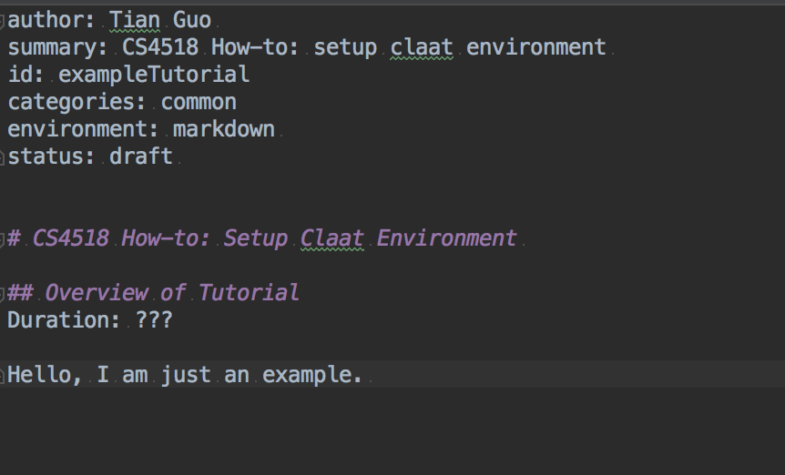
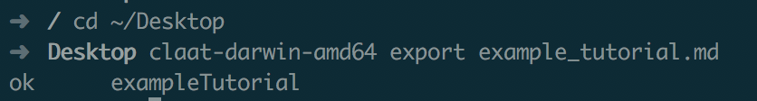
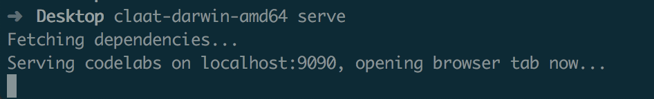
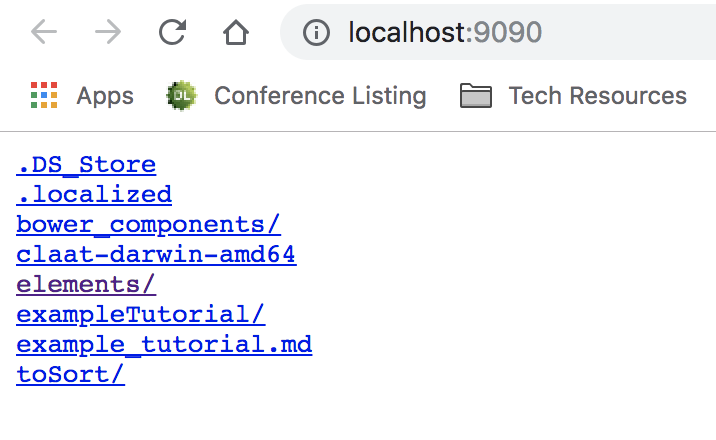

author: Tian Guo 
summary: CS4518 How-to: generate codelab style tutorial from markdown 
id: markdown2Codelabs
categories: common
environment: MacOS, markdown 
status: draft 


# CS4518 How-to: generate codelab style tutorial from markdown

## Overview of Tutorial
Duration: ???

This tutorial will show you how to setup the Codelabs management & hosting tools `claat` in a Unix-based machine. 

Positive 
: The tutorial is based on MacOS, but should be applicable to other Linux based environment. 

For more detail, refer to the [tool github](https://github.com/googlecodelabs/tools)


## Download the pre-compiled binary of `claat`

Go to the official release [link](https://github.com/googlecodelabs/tools/releases/tag/v1.1.0) for the Codelabs command line tool `claat`, and download the binary according to your OS. 


`Fig: Precompiled Claat binaries for popular OSes.`

For example, if you have a recent MacOS, download the `claat-darwin-amd64` binary under **Assets** to a path, e.g., `~/Desktop`.


## Write the tutorial in markdown 

Here is an example markdown, that contains the bare minimal. The first few lines contain the meta data that `claat` will parse. Among which, the important one is `id`. As you will see in the next step, the value of `id` will be used as the generated directory name. 


`Fig: An example markdown file called example_tutorial.md.`

Positive
: If you are not familiar of how to write markdown, the claat parser provides a very quick tutorial [here](https://github.com/googlecodelabs/tools/tree/master/claat/parser/md). 

## Generate the html 

Recall that we have saved the `claat` binary to `~/Desktop` in the previous step. By running the following commands in a terminal, you will see a similar output to the following screenshot. Inside the `exampleTutorial` directory, you will find the converted `index.html`. 

```bash
cd ~/Desktop; 
claat-darwin-amd64 export example_tutorial.md
```


`Fig: claat export terminal output`

Positive
: If you want to make the `claat` command accessible globally in your system, you could create a symbolic link of the downloaded binary into a binary directory that is included in $PATH. For example, `sudo ln -s /Users/tian/Desktop/claat-darwin-amd64 /usr/local/bin`. 


## Download the necessary codelab dependencies  

If we run the following commands, `claat` will automatically fetch the dependencies: `elements/` and `bower_components/`. These two directories contain javascript and style files that will be used by the `index.html` 


``` bash
cd ~/Desktop
claat-darwin-amd64 serve 
```

After downloading the dependencies, a local server is also created: 


`Fig: claat starts a local server that listens at 9090 port.`


A new browser tab should open automatically for you, and display hyperlinks for all resources in the current directory, i.e., `~/Desktop`. 


`Fig: claat starts a local server that listens at 9090 port.`

Click on the hyperlink `exampleTutorial/` will bring up the codelab style tutorial. 


`Fig: codelab style tutorial served at localhost:9090.`


## Hosting your own publicly available codelabs 

As explained in this [link](https://github.com/googlecodelabs/tools), most popular web servers should be able to host the generated codelab resources.

In our example, simply upload the following three directories: `elements/`,  `bower_components/`, `exampleTutorial/` to your favorite web server. 

Positive
: Note you are not required to do so for our course projects. Simply checking that your markdown file can render correctly in a local server is sufficient.  

## Summary 

In this tutorial, we explain how to setup the official Codelabs management & hosting tools in Unix-like environment, and how to verify that the markdown tutorial is rendered correctly in local host. 