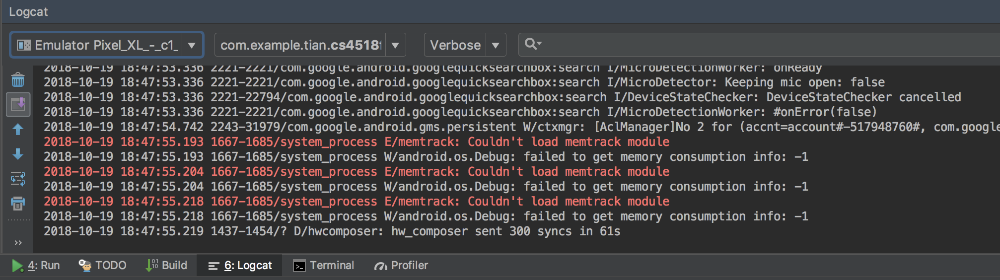
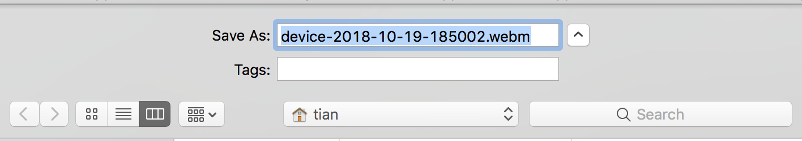

author: Tian Guo 
summary: CS4518 How-to: record app video tutorial
id: recordVideo
categories: common
environment: java
status: draft 

# CS4518 How-to: Record App Video 
## Overview of Tutorial
Duration: ???

This tutorial will show you how to record a video of your app's features, as required by all project submissions. 

Prerequisites:

* Android Studio 3.2
* Android physical or virtual devices API 27 

## Make sure your project code is complete 

After you finished your project code, and make sure that your app behaves as expected when running in physical device or AVD. That is, the Android Studio is able to install the app to the device. 

On the top right of Android Studio, you could first use the green arrow showed below to install the apk to an Android device. 

`Fig: Use the green arrow to run the app, or the lightening symbol to apply the change. `

## Choose the desired Android device 

If there is no USB devices currently connected, or no AVD is running, you will be prompted with the following window. Select the desired device for deploying your app. 

`Fig: The Connected Devices section lists USB connected devices and any running AVDs.`

## Use Logcat to record video 

Prepare your device for recording by navigating to your app's desired features in the Android device. Once you are ready, switch back to the Android Studio, and click on the `Logcat` window at the bottom part. You should be able to see similar output as below. Next, click the small double arrow button right above the `green 4:Run` button. 

`Fig: Click 6:Logcat or View->Tool Windows->Logcat to bring up the window`

A new floating window, similar to the following screenshot, should appear. Click the 4th button that has a green background (in between the camera button and red terminate button). 

`Fig: If all the buttons are grey out, it most likely means that your connected device does not support video recording.`

Positive 
: Even though we only show how to use Logcat to record a video for an app running in AVD. This feature should work on most newer physical device. Alternatively, you could download any free screen-recording apps such as AZ Screen Recorder from Google Play Store. 

## Configure the screen recording option

A window similar to the following will pop up. You can just use the default options and then hit **Start Recording**. 

`Fig: Logcat video recording options`

## Interact with your app 

Once the recording start, a `Screen Recorder` window will display the time elapsed. Try to plan your app interaction ahead of time to minimize the video length. 

`Fig: Video recording in progress` 

Positive
: If you have implemented a lot of additional features, and cannot realistically fit all recordings in 3 minutes. You could repeat the above process and record two separate videos. 

Negative
: Note that `Logcat` built-in video record features only support recording a video up to 3 minutes. 

## Save your video recording 

Once your are done recording, hit the button `Stop Record` and then Android Studio will prompt you to save your video in the `webm` format. 
Rename your video recording file to match the appropriate project submission. 

`Fig: Save the video recording as webm format. You can check the video recording with any modern browswers that support HTML5, e.g., Chrome.`

## Summary 

In this tutorial, we introduce how to use `Logcat` built-in video recording tool to generate `webm` format video recording. 

